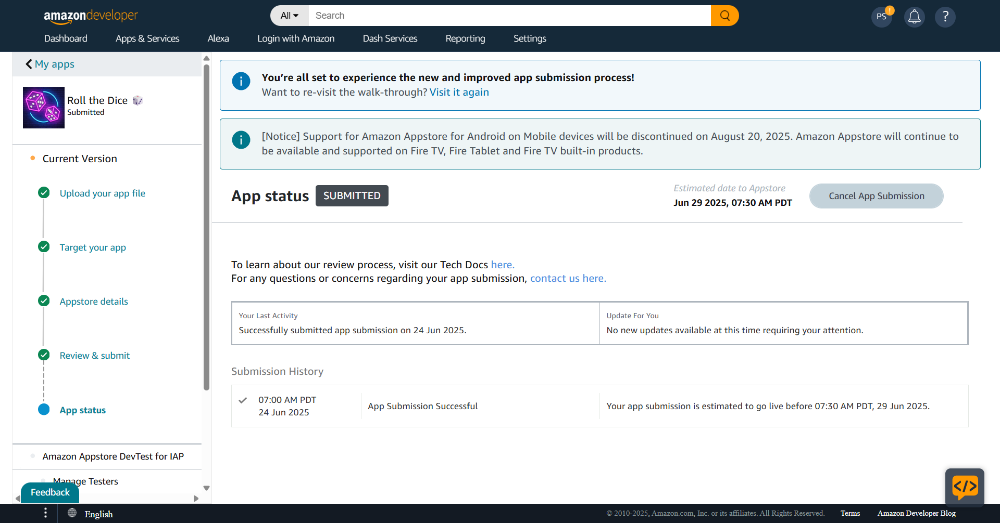

# RollTheDice 🎲

Roll the Dice is app where user clik on the roll button and get dice with number.it is built using ReactNative. 

## Download

Click Below Link to get APP From App Store

  📲📱[Amazon APP Store](https://www.amazon.com/Prajapati-Kashyap-Sanjaybhai-Roll-Dice/dp/B0FFBMLGQW/ref=sr_1_12?dib=eyJ2IjoiMSJ9.LRYCkJNPpMn49cPEBLoSIMuKEccDhLNUTFaPcTAFcn5I71Pw_kFLqCqYd8cCvkGh27YFvxuazXR5P-yFklnrTXqzHHTR5oq_QbZEDxmIXQf2XES9gmjnEZlk6riHfuXNdpERN1gdq4vSyuxseejlEPTPRlIimLRSN1cKz3A4lqDTbYYIcW8WWF5zIW7OShzmPrLwmGCFhXYPViiLBTRdEHzIV76Ffgi7ayIZLOJuyKq6FkZlCSDrCPhjDxv-f6cHqn5odbQkHoqOLMvIN0rZ6dr0Hwbu7nkErkmEt5nyhGs.MAxR9D1knrWzTTWojqkoFgnlBwZrebSK1cyzEPA5Quw&dib_tag=se&keywords=Roll+The+Dice&qid=1750852837&s=mobile-apps&sr=1-12)


Click the button below to download the APK for Android.

[](https://drive.google.com/file/d/1JtI_d3ujdw0QCdvUP-TpzvdaSTMQ8Qvj/view?usp=sharing
)
---
# Amazon App Store 

### Application submitted -- Step1 


### Application Under Review -- Step2


### Test & Validation Pass --Step3


### Live At Amazon App Store --Step4


---


## Demo Images

Below are some screenshots of the RollTheDice app:

### App Icon


### First Screen


### After click on RollTheDice Button Screen


## Steps for Developers

If you are a developer and want to fork this repository, follow the steps below:

1. **Fork the Repository**: Click on the 'Fork' button at the top right corner of this repository to create a copy in your GitHub account.

2. **Clone the Repository**: Clone the forked repository to your local machine using the following command:
    ```sh
    git clone https://github.com/your-username/RollTheDice.git
    ```
    Replace `your-username` with your GitHub username.

3. **Navigate to the Project Directory**:
    ```sh
    cd RollTheDice
    ```

4. **Install Dependencies**:
    ```sh
    npm install
    ```

5. **Set Up the Android Environment**:
    Make sure you have Android Studio and the Android SDK installed. Set up the necessary environment variables:
    ```sh
    export ANDROID_HOME=/path/to/your/android/sdk
    export PATH=$PATH:$ANDROID_HOME/tools:$ANDROID_HOME/platform-tools
    ```

6. **Run the App**:
    To run the app on an Android emulator or connected device:
    ```sh
    npx react-native run-android
    ```

7. **Generate a Release APK**:
    To generate a release APK, navigate to the `android` directory and run:
    ```sh
    cd android
    ./gradlew assembleRelease
    ```

    The APK will be generated at `android/app/build/outputs/apk/release/app-release.apk`.

Feel free to customize this README.md as per your project's requirements.
